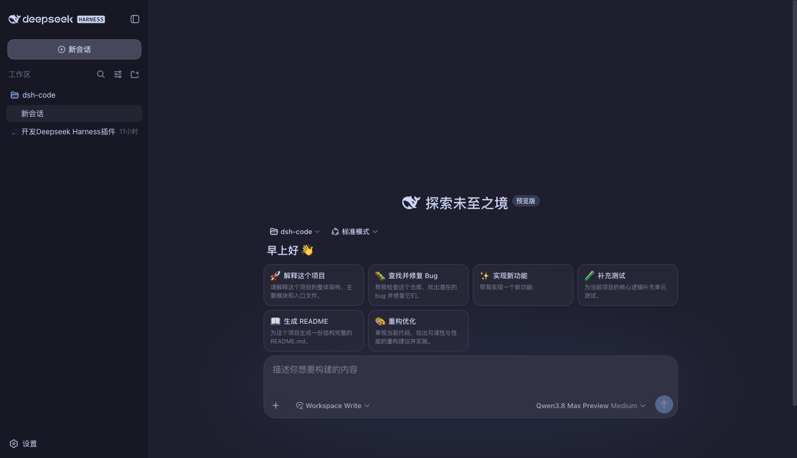
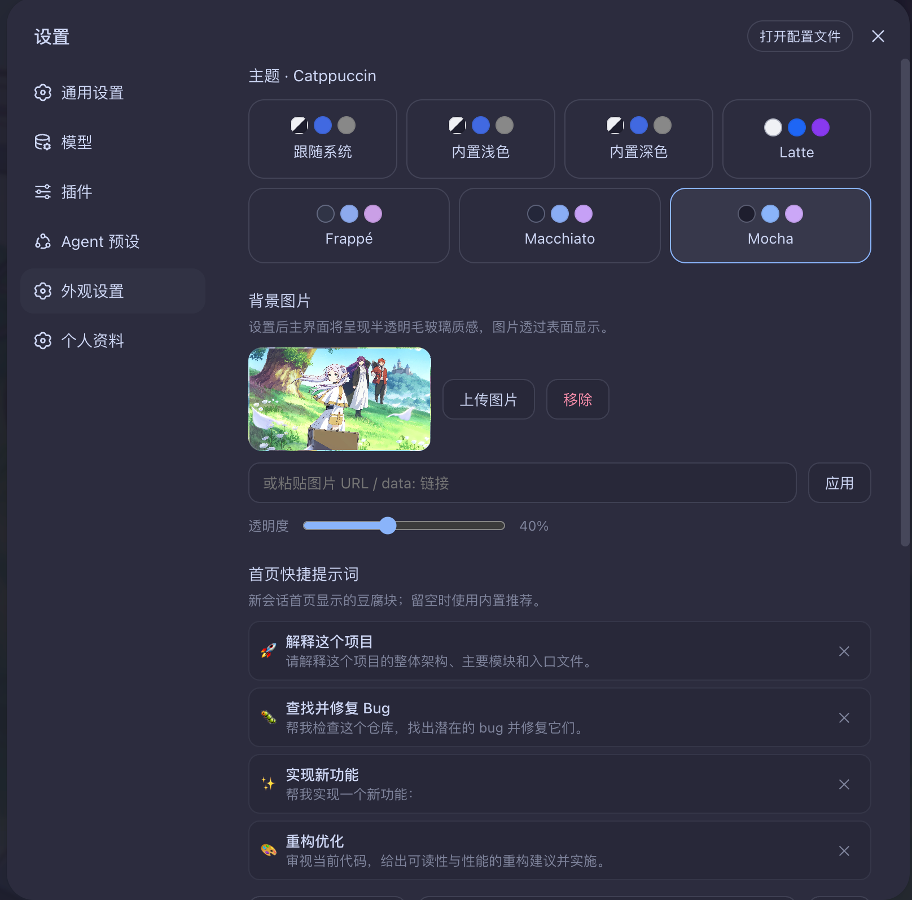
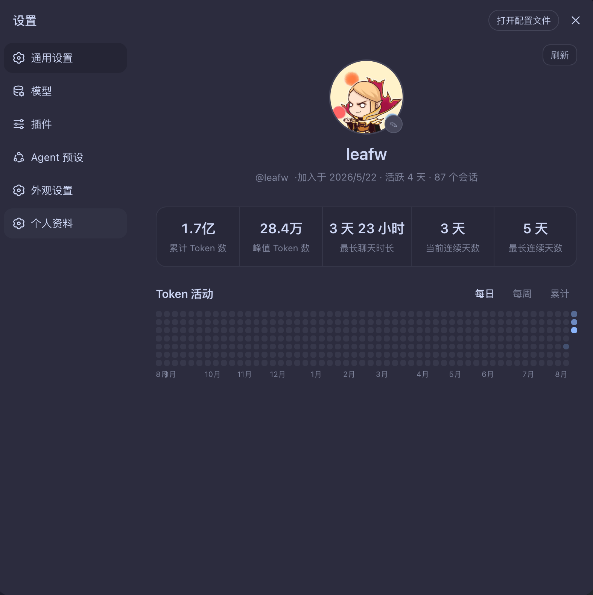
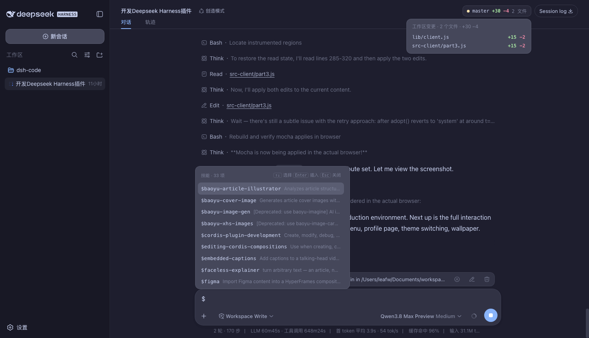
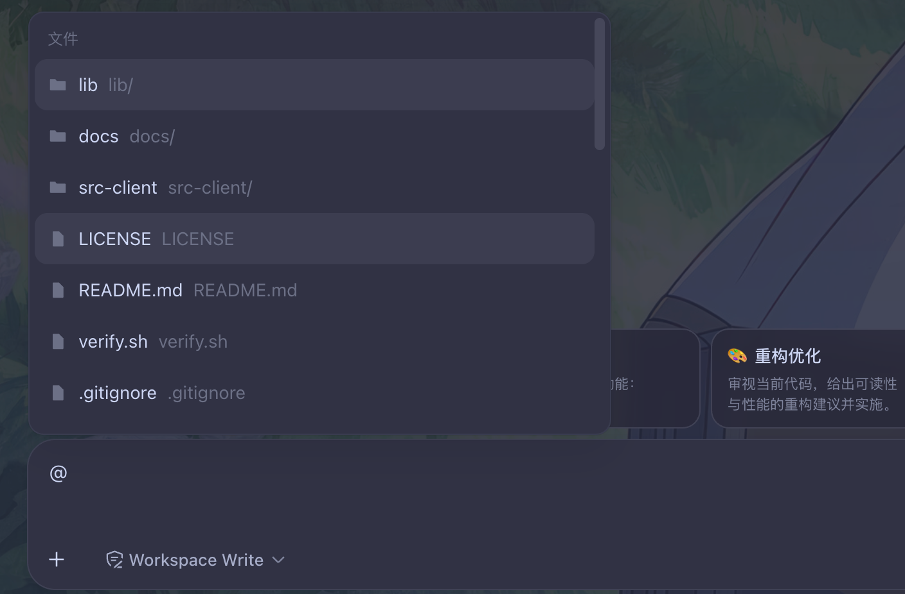

# dsh-code

为 [DeepSeek Harness](https://github.com/deepseek-ai/deepseek-harness)（`dsh`）打造的
Codex 风格体验插件：Catppuccin 主题、壁纸等各种自定义外观设置、Git 变更卡片、子智能体卡片、
`$` 技能触发、`@` 文件快捷引用、简单版的宠物，以及带活动热力图的个人资料页。







## 功能

1. **Catppuccin 主题** — Latte / Frappé / Macchiato / Mocha 四种风味，也可随时切回
   内置浅色 / 深色 / 跟随系统。设置入口：设置 →「Codex 外观」。
2. **背景壁纸** — 上传图片或粘贴 URL，界面变为半透明毛玻璃透出壁纸，透明度可调。
3. **首页样式调整** — 新会话首页输入框下沉到底部，上方显示问候语与快捷提示词
   "豆腐块"（点击即填入输入框；可在「Codex 外观」中增删自定义），支持宽屏模式。
4. **Git 变更卡片** — 在 git 仓库目录下运行的会话，头部右上角显示
   `● 分支 +新增 −删除 N 文件`，点击展开逐文件变更清单。
5. **子智能体卡片** — 会话使用子智能体时，右上角显示 `🤖 n 智能体`，
   运行中绿点脉冲；展开可见每个智能体的标签与 单次/可续 徽标，点击行跳转。
6. **`$` 技能触发** — 输入框键入 `$` 唤出技能列表（`↑↓` 选择、`Enter` 插入
   `/技能名 `、`Esc` 关闭）；`/` 命令保持原生行为。
7. **`@` 文件快捷引用** — 会话输入框键入 `@` 唤出工作区文件/文件夹候选列表
   （模糊搜索、`↑↓` 选择、`Enter`/点击插入、`Esc` 关闭）。插入后输入框内以
   Codex 风格「芯片」展示：只显示最终文件（夹）名 + 图标，悬停可见完整相对
   路径，`Backspace` 在芯片末尾整块删除。
8. **状态宠物** — Codex 风格右下角浮动伙伴（猫咪 / 小狗 / 机器人 / 幽灵 /
   幻兽帕鲁「瞅什魔」五种外观）。每种状态有独立的行为动画, 悬停看气泡，点击固定，拖拽移动；大小可在设置中调节（48–128px）。目前暂只支持在当前工作区的动作变化。
9. **个人资料页** — 设置 →「个人资料」：头像（可上传）+ 用户名、累计 Tokens、
   峰值 Tokens / 单请求、最长聊天时长、当前 / 最长连续天数，以及 GitHub 风格
   活动热力图（每日 / 每周 / 累计 三种视图）。





## 安装

前置条件：已安装并运行过 `dsh`（`~/.dsh` 存在，web profile 已初始化）。

```sh
git clone git@github.com:careywyr/dsh-code.git
cd dsh-code
node install.mjs   # 自动完成链接与注册（幂等，可重复执行）
# 重启 dsh web 服务，然后刷新浏览器
```

> 升级 dsh 导致 npx 缓存重建后，重跑 `node install.mjs` 即可恢复。

## 使用

- **主题 / 壁纸 / 快捷提示词**：设置 →「Codex 外观」。
- **个人资料 / 头像**：设置 →「个人资料」。
- **`$` 技能**：输入框键入 `$`，列表选择后插入 `/技能名 `。
- **`@` 文件引用**：会话输入框键入 `@`，列表选择文件/文件夹后以芯片形式插入。
  该功能在**首次安装或更新后需重启一次 dsh web** 才生效；重启前菜单会显示
  「文件搜索待启用」提示。

## 从旧版（dsh-codex-clone）升级

本插件由 `dsh-codex-clone` 更名为 `dsh-code`。老用户只需：

```sh
git pull
node install.mjs   # 自动清理旧的 dsh-codex-clone 注册并注册 dsh-code
# 重启 dsh web 服务，然后刷新浏览器
```

`install.mjs` 会自动完成迁移：删除旧的 `dsh-codex-clone` 符号链接、移除
`cordis.patch.yml` 中旧的 insert 块，再注册新的 `dsh-code`。
浏览器本地存储（主题 / 壁纸 / 快捷提示词 / 宠物位置等）也会在首次打开页面时
自动从旧键（`dsh-codex-clone:*`）迁移到新键（`dsh-code:*`），**配置不会丢失**。

> 如果之前是手动注册的，请先手动删除 `cordis.patch.yml` 里 `dsh-codex-clone`
> 的 insert 块和两个旧符号链接，再执行上面的步骤。

## 卸载

1. 删除 `~/.dsh/profiles/web/cordis.patch.yml` 中 `dsh-code` 的 insert 块；
2. 删除符号链接：`~/.dsh/profiles/node_modules/dsh-code` 与 dsh 安装树
   `node_modules/dsh-code`；
3. 重启 `dsh web`。

## 许可

[MIT](LICENSE)
