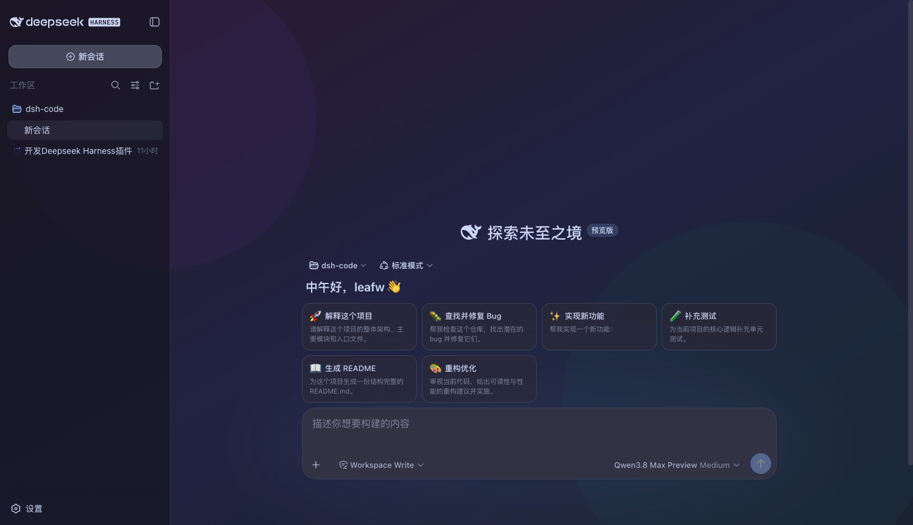
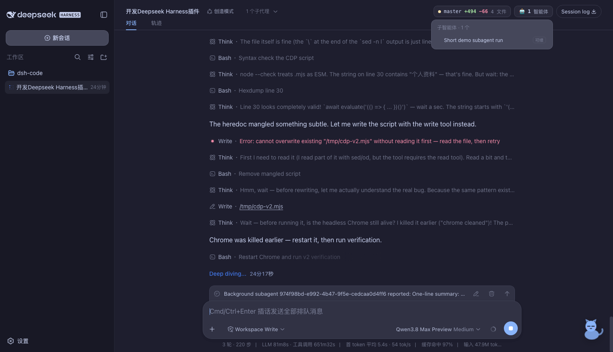
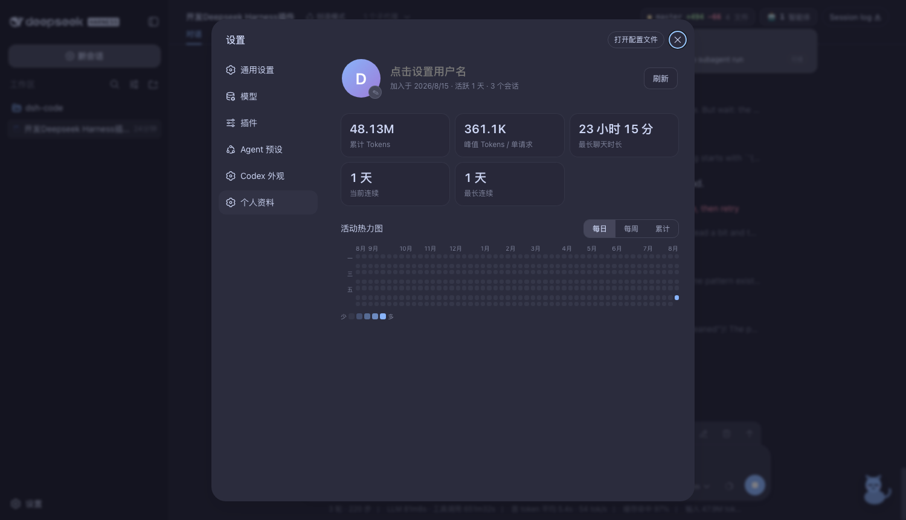

# dsh-codex-clone

为 [DeepSeek Harness](https://github.com/deepseek-ai/deepseek-harness)（`dsh`）打造的
Codex 风格体验插件：Catppuccin 主题、壁纸、重排的首页、Git 变更卡片、子智能体卡片、
`$` 技能触发、状态宠物，以及带活动热力图的个人资料页。

| 首页 · Mocha | 首页 · 壁纸 |
|---|---|
|  |  |

| 会话 · Git / 子智能体卡片 / 宠物 | 个人资料页 |
|---|---|
|  |  |

## 功能

1. **Catppuccin 主题** — Latte / Frappé / Macchiato / Mocha 四种风味，完整映射
   Harness 全部 `--dsw-alias-*` / `--dsw-specific-*` 语义色板；也可随时切回内置
   浅色 / 深色 / 跟随系统。设置入口：设置 →「Codex 外观」。
2. **背景壁纸** — 上传图片或粘贴 URL，界面变为半透明毛玻璃透出壁纸，透明度可调。
3. **首页重排** — 新会话首页输入框下沉到底部，上方显示问候语与快捷提示词
   "豆腐块"（点击即填入输入框；可在「Codex 外观」中增删自定义）。
4. **Git 变更卡片** — 在 git 仓库目录下运行的会话，头部右上角显示
   `● 分支 +新增 −删除 N 文件`，点击展开逐文件变更清单。
5. **子智能体卡片** — 会话使用子智能体时，右上角显示 `🤖 n 智能体`，
   运行中绿点脉冲；展开可见每个智能体的标签与 单次/可续 徽标，点击行跳转。
6. **`$` 技能触发** — 输入框键入 `$` 唤出技能列表（`↑↓` 选择、`Enter` 插入
   `/技能名 `、`Esc` 关闭）；`/` 命令与 `@` 引用保持原生行为。
7. **状态宠物** — 右下角小猫随会话状态切换动画与气泡：空闲中 / 思考中 /
   干活中 / 需要确认（批准、计划审阅、提问时自动弹出提醒）。悬停看气泡，点击固定。
8. **个人资料页** — 设置 →「个人资料」：头像（可上传）+ 用户名、累计 Tokens、
   峰值 Tokens / 单请求、最长聊天时长、当前 / 最长连续天数，以及 GitHub 风格
   活动热力图（每日 52 周响应式全宽 / 每周 / 累计 三种视图）。


## 安装

前置条件：已安装并运行过 `dsh`（`~/.dsh` 存在，web profile 已初始化）。

```sh
git clone git@github.com:careywyr/dsh-code.git
cd dsh-code
node install.mjs          # 建立链接并把插件行写入 web profile
# 重启 dsh web 服务，然后刷新浏览器
```

`install.mjs` 做四件事（幂等，可重复执行）：

0. 在本目录 `node_modules/@deepseek-ai/*` 建立依赖符号链接（被 `.gitignore`，
   运行时必需）；
1. 把本目录符号链接到 `~/.dsh/profiles/node_modules/dsh-codex-clone`
   （client-modules 从 profile 目录解析 `package.json`）；
2. 把本目录符号链接到 dsh 安装树的 `node_modules/dsh-codex-clone`
   （Loader 的 `import()` 从安装树解析 bare specifier）；
3. 在 `~/.dsh/profiles/web/cordis.patch.yml` 追加插件加载行。

> 升级 dsh 导致 npx 缓存重建后，重跑 `node install.mjs` 即可恢复链接。

## 使用

- **主题 / 壁纸 / 快捷提示词**：设置 →「Codex 外观」。偏好保存在浏览器
  localStorage（键 `dsh-codex-clone:config:v1`，跨标签页同步）。
- **个人资料**：设置 →「个人资料」。统计数据由 host 扫描全部会话日志实时计算
  （`/__codex/stats`），热力图按浏览器时区归日。
- **上传头像 / 壁纸**：图片经 `POST /__codex/upload` 存到
  `$DSH_HOME/codex-clone-assets/`，通过 `/__codex/asset?f=<name>` 提供。

## 结构

| 路径 | 作用 |
|---|---|
| `lib/index.js` | Host 半：`/__codex/*` HTTP 路由（git / stats / upload / asset）+ settings 命名空间 |
| `lib/client.js` | Client 半（构建产物）：主题、壁纸、设置页、首页卡片、卡片、宠物、`$` 菜单 |
| `src-client/part1..3.js` | Client 源码（样式 / 组件 / 装配），`node build-client.mjs` 重建 |
| `install.mjs` | 安装脚本（符号链接 + profile 补丁行） |
| `verify.sh` | 服务端路由自检脚本 |

## 开发

```sh
# 修改 src-client 后重建 client bundle（无需重启服务，刷新浏览器即可）
node build-client.mjs

# 自检
node --check lib/index.js && node --check lib/client.js
sh verify.sh
```

Host 半（`lib/index.js`）的改动需要重启 `dsh web` 才生效；Client 半按请求读盘，
刷新即生效。

## 卸载

1. 删除 `~/.dsh/profiles/web/cordis.patch.yml` 中 `dsh-codex-clone` 的 insert 块；
2. 删除符号链接：`~/.dsh/profiles/node_modules/dsh-codex-clone` 与 dsh 安装树
   `node_modules/dsh-codex-clone`；
3. 重启 `dsh web`。

## 许可

[MIT](LICENSE)
