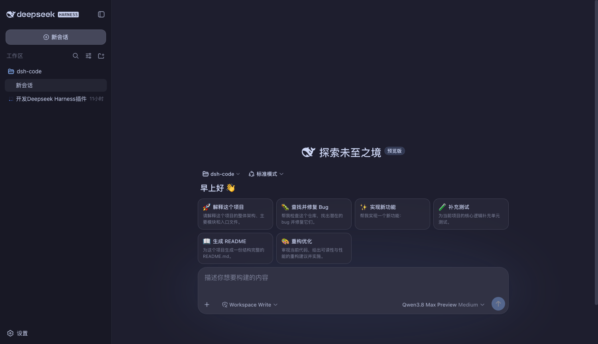
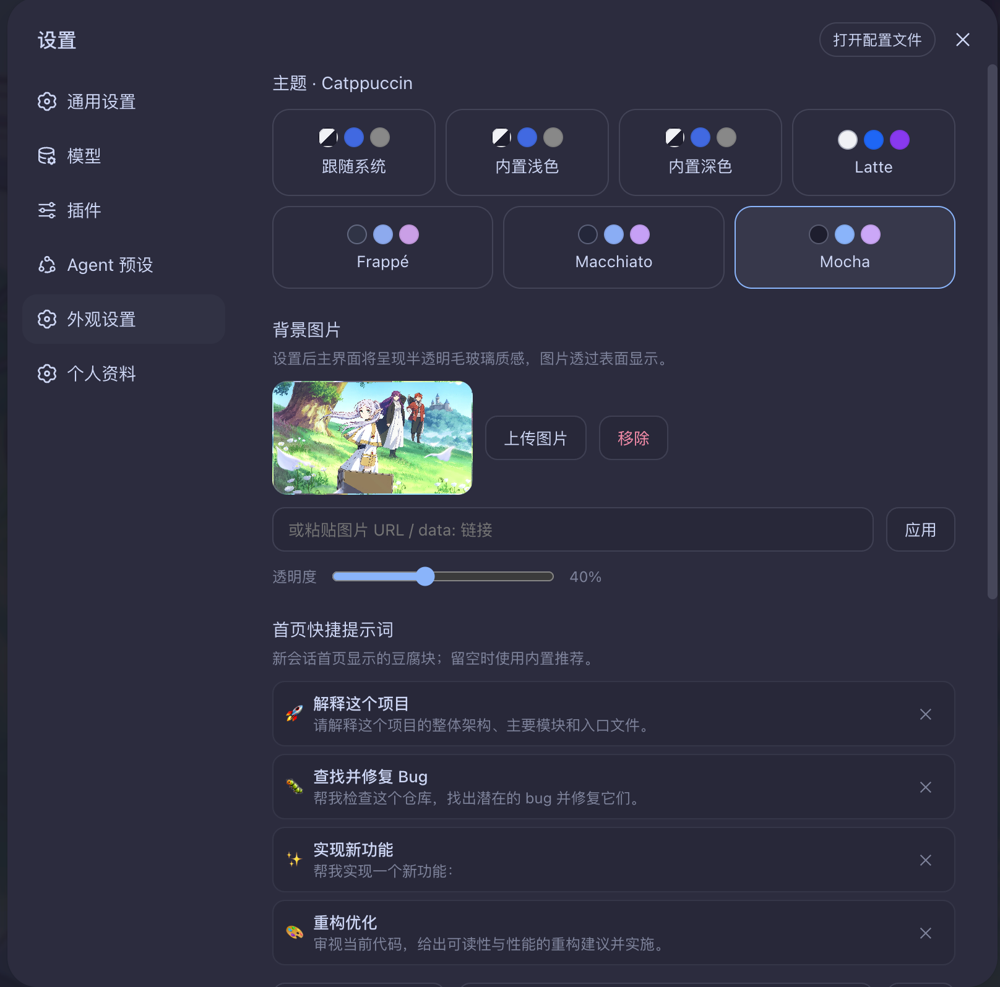
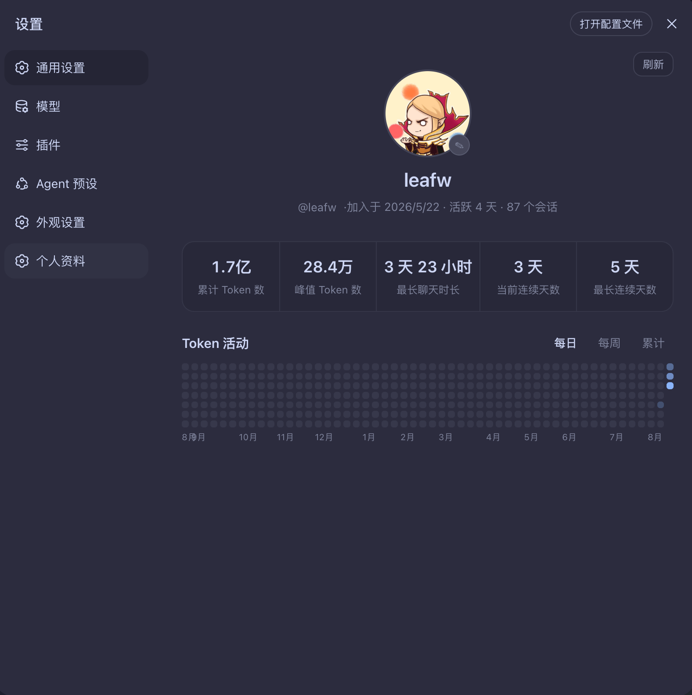
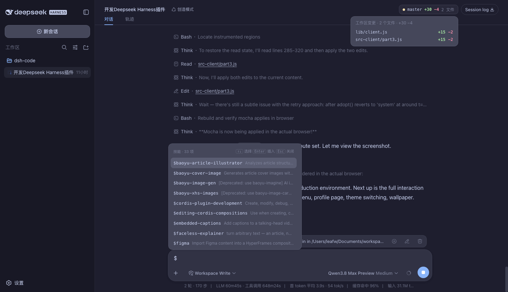
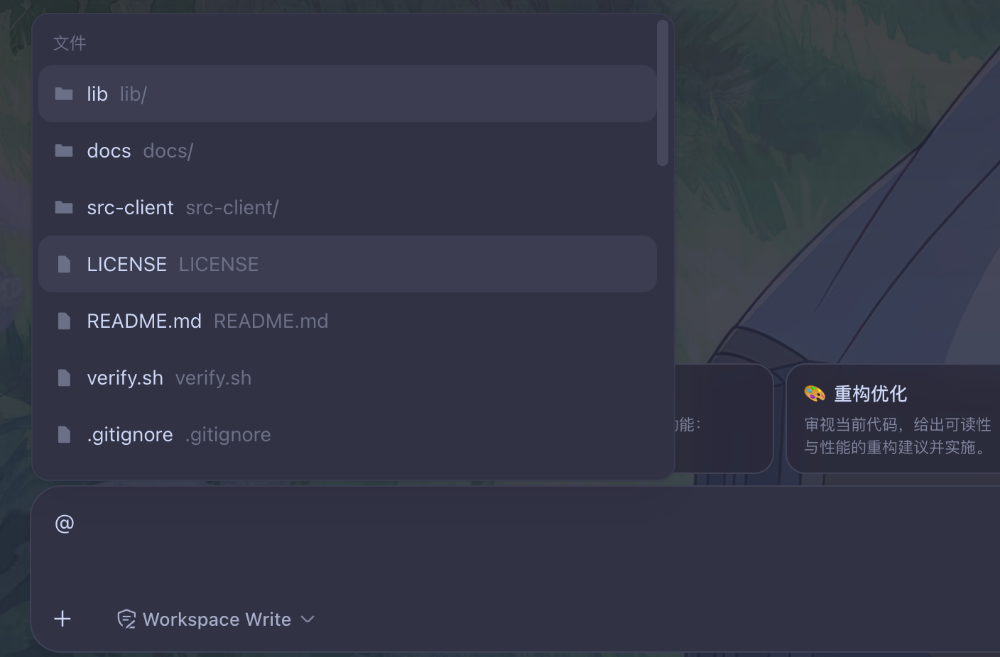

# dsh-code

为 [DeepSeek Harness](https://github.com/deepseek-ai/deepseek-harness)（`dsh`）打造的
Codex 风格体验插件：Catppuccin 主题、壁纸等各种自定义外观设置、Git 变更卡片、
`$` 技能触发、`@` 文件快捷引用、简单版的宠物、带活动热力图的个人资料页，
以及可在侧栏内查看与编辑文件的项目文件树侧栏。







## 功能

1. **Catppuccin 主题** — Latte / Frappé / Macchiato / Mocha 四种风味，也可随时切回
   内置浅色 / 深色 / 跟随系统。设置入口：设置 →「Codex 外观」。
2. **背景壁纸** — 上传图片或粘贴 URL，界面变为半透明毛玻璃透出壁纸，透明度可调。
3. **首页样式调整** — 新会话首页输入框下沉到底部，上方显示问候语与快捷提示词
   "豆腐块"（点击即填入输入框；可在「Codex 外观」中增删自定义），支持宽屏模式。
4. **Git 变更卡片** — 在 git 仓库目录下运行的会话，头部右上角显示
   `● 分支 +新增 −删除 N 文件`，点击展开逐文件变更清单。
5. **`$` 技能触发** — 输入框键入 `$` 唤出技能列表（`↑↓` 选择、`Enter` 插入
   `/技能名 `、`Esc` 关闭）；`/` 命令保持原生行为。
6. **`@` 文件快捷引用** — 会话输入框键入 `@` 唤出工作区文件/文件夹候选列表
   （模糊搜索、`↑↓` 选择、`Enter`/点击插入、`Esc` 关闭）。插入后输入框内以
   Codex 风格「芯片」展示：只显示最终文件（夹）名 + 图标，悬停可见完整相对
   路径，`Backspace` 在芯片末尾整块删除。
7. **状态宠物** — Codex 风格右下角浮动伙伴（猫咪 / 小狗 / 机器人 / 幽灵 /
   幻兽帕鲁「瞅什魔」五种外观）。每种状态有独立的行为动画, 悬停看气泡，点击固定，拖拽移动；大小可在设置中调节（48–128px）。目前暂只支持在当前工作区的动作变化。
8. **个人资料页** — 设置 →「个人资料」：头像（可上传）+ 用户名、累计 Tokens、
   峰值 Tokens / 单请求、最长聊天时长、当前 / 最长连续天数，以及 GitHub 风格
   活动热力图（每日 / 每周 / 累计 三种视图）。
9. **文件预览侧栏** — 点击对话中提到的文件（原生文件引用、形似路径的行内代码）
    或 Git 变更卡片中的文件，右侧推挤式侧边栏即时预览：Markdown 按 GFM/公式
    渲染（可一键切源码，**Markdown 内相对路径的图片也能正常显示**，走
    `/__codex/raw` 原始字节路由）、代码按扩展名语法高亮并带行号、图片直接内联
    显示、目录列出条目可继续点开。支持拖动调宽、`Esc` 关闭、复制路径；
    Git 卡片同时列出未跟踪文件。
10. **项目文件树侧栏（Codex 风格右侧 dock）** — 右上角与左侧侧边栏同高的
    展开/收起按钮。展开后**文件树固定在最右侧**（目录逐层展开/折叠、一键刷新
    与全部折叠）；点击文件在文件树**左侧的独立编辑区**打开，多个文件即多个
    **标签页**：点 tab 切换、✕ 关闭（有未保存修改会先确认）、脏状态在 tab 上
    以圆点提示。**非 Markdown 文本文件打开即可直接编辑，且编辑时保留语法高亮
    与行号**（透明输入层叠加在高亮层上的 overlay 编辑器）；只有 Markdown 提供
    「预览 / 编辑」切换（默认渲染预览，含行内图片），改完保存（`Ctrl/Cmd+S` 或
    保存按钮，带磁盘 mtime 冲突保护）；图片内联查看。
    切换 tab 不丢失已加载内容与未保存草稿。与文件预览侧栏一样仅维持在当前会话：
    切换会话即自动关闭并清空标签页；两个右侧面板互斥，打开其一自动收起另一个。
    文件树与编辑区宽度均可左缘拖动调节，分别记忆在本地。
11. **DeepSeek Harness 版本显示** — 设置 →「通用」分区最底部显示当前运行的
    DeepSeek Harness（`@deepseek-ai/dsh`）版本号，便于确认实际生效的版本
    （走宿主路由 `/__codex/version`，从运行进程的 dsh 安装树解析）。
12. **飞书机器人** — 设置 →「飞书机器人」：配置飞书自建应用的
    `App ID`/`App Secret` 与推送目标（用户/群聊）后，机器人通过**官方长连接**
    （无需公网回调）双向接入：
    - **全局监控推送**：任何会话任务结束（推送最后一条回复）、需要权限审批、
      等待回答 `ask_user_question`、任务出错，都会实时推送到指定飞书用户/群
      （非阻塞推送只针对主智能体会话：子智能体的任务结束/出错被过滤；但
      子智能体**需要审批**、**等待回答**这类阻塞事件仍会推送并标注来源，
      避免子任务卡住无人知晓；`/list` 只列主智能体会话）；
      推送默认渲染为 **Markdown 卡片**（代码块/列表/加粗正常显示），可在设置里
      切换为**富文本**纯文字形态；
    - **远程操控**：在飞书单聊里直接发文字即转发给「焦点会话」（等价于在界面
      输入框发送），任务结束的回复又自动推送回来，形成**多轮对话闭环**；
      也可用指令列出/切换/新建/取消会话、批准或拒绝权限审批、回答提问；
    - **安全**：仅白名单内的飞书 `open_id` 可操控，白名单为空时只读；
    - **侧边栏状态灯**：左侧边栏底部显示飞书机器人连接状态（绿=已连接/黄=
      连接中/红=出错/灰=未启用），并带一个开关，可**免重启**随时启停机器人。





## 安装

前置条件：已安装并运行过 DeepSeek Harness（`~/.dsh` 存在，profile 已初始化）。
支持 **网页端**（`dsh web`）和**桌面客户端**（DeepSeek Harness.app），安装脚本会
自动发现并注册所有已存在的 profile。

```sh
git clone git@github.com:careywyr/dsh-code.git
cd dsh-code
node install.mjs   # 自动完成链接与注册（幂等，可重复执行）
# 重启 dsh（网页端重启 web 服务 / 桌面客户端退出重开）
```

> 升级 dsh 导致 npx 缓存重建后，重跑 `node install.mjs` 即可恢复。

## 使用

- **主题 / 壁纸 / 快捷提示词**：设置 →「Codex 外观」。
- **个人资料 / 头像**：设置 →「个人资料」。
- **`$` 技能**：输入框键入 `$`，列表选择后插入 `/技能名 `。
- **`@` 文件引用**：会话输入框键入 `@`，列表选择文件/文件夹后以芯片形式插入。
  该功能在**首次安装或更新后需重启一次 dsh web** 才生效；重启前菜单会显示
  「文件搜索待启用」提示。
- **文件预览侧栏**：点击对话里的文件引用（或形似路径的行内代码）、Git 变更
  卡片中的文件，即在右侧打开预览侧栏；`Esc` 或右上角 ✕ 关闭，左缘可拖动调宽。
  内容读取走宿主路由 `/__codex/file`，因此**更新后需重启一次 dsh web**；
  重启前点击会提示「文件预览服务未就绪」。
- **项目文件树侧栏**：点击右侧最顶部（与左侧侧边栏折叠按钮同高）的方形面板
  按钮即可展开/收起。展开后**文件树固定在最右侧**；点击文件在文件树**左侧的
  独立编辑区**打开，多文件即多标签页——点 tab 切换、✕ 关闭、脏修改在 tab 上以
  圆点提示，切换 tab 不丢草稿。**非 Markdown 文本文件打开即可直接编辑，编辑时保留
  语法高亮与行号**；Markdown 默认渲染预览（**相对路径图片也能正常显示**）并可切
  「编辑」改源码，图片内联查看。改完「保存」或按 `Ctrl/Cmd+S` 写回磁盘。
  切换会话自动关闭并清空标签页，且与文件预览侧栏互斥
  （打开其一自动收起另一个）。文件树走宿主路由 `/__codex/tree`、保存走
  `POST /__codex/file`、Markdown 图片走 `/__codex/raw`，因此**更新后需重启一次
  dsh web**；重启前会分别提示「文件树服务未就绪」「保存服务未就绪」。
- **Harness 版本显示**：设置 →「通用」分区最底部一行显示当前 DeepSeek Harness
  版本。版本号走宿主路由 `/__codex/version`（从运行进程所在 dsh 安装树解析
  `@deepseek-ai/dsh` 的 `package.json`），因此**更新后需重启一次 dsh web**；
  重启前该行会显示「未知」。
- **飞书机器人**：设置 →「飞书机器人」。首次使用按下列步骤：
  1. 在[飞书开放平台](https://open.feishu.cn)创建**企业自建应用**，取得
     `App ID` 与 `App Secret`；
  2. 应用能力里**开启机器人**；权限管理中开通 `im:message`（收发消息）；
  3. 事件与回调 → 事件订阅方式选择**「使用长连接接收事件」**（无需公网域名），
     并添加事件 `im.message.receive_v1`；
  4. 在本插件设置页填入 `App ID`/`App Secret`，添加**推送目标**（用户填
     `open_id`，群聊填 `chat_id` 且需先把机器人拉进该群）；
  5. 把你自己的 `open_id` 加入**操作白名单**（在飞书里给机器人发 `/id` 即可
     查询），否则只能接收推送、不能操控；
  6. 点「发送测试消息」验证，再打开「启用飞书机器人」并保存。

  之后：任务结束/审批/提问/出错会自动推送。**收到某个会话的通知时，你的焦点会
  自动切换到该会话**——因此直接发文字就能继续它，无需先 `/use`；回复会自动推送
  回来。指令：`/list` 会话列表、`/use <序号>` 切换焦点、`/new <内容>` 新建会话、
  `/cancel` 取消回合、`批准`/`拒绝 [序号]` 处理审批、数字或选项文字回答提问、
  `/id` 查询 open_id、`/help` 帮助。群聊中需 @机器人；「引用回复」某条通知消息
  也能定位到对应会话（对重启前发出的旧通知无效）。

  **推送形态**：默认「Markdown 卡片」，助手回复里的代码块/列表/加粗会正常渲染；
  若所在租户卡片受限或想要纯文字，可在设置的「推送形态」切换为「富文本」。
  注意卡片不渲染表格（飞书限制），表格类内容建议切富文本或精简。

  **样例卡片**：调试用路由 `POST /__codex/feishu/demo`，body
  `{"type":"turnEnd|approval|question|error"}`，可向目标推送对应类型的样例卡片
  （不影响真实会话与焦点），方便预览四种通知的渲染效果。
  > 机器人依赖 `@larksuiteoapi/node-sdk`，`install.mjs` 会自动 `npm install`；
  > 该路由属宿主侧，**更新后需重启一次 dsh web** 才生效。

## 升级 dsh（npx 版本与缓存）

`npx` 按「包@版本规格」把安装缓存到 `~/.npm/_npx/<hash>/`，**每个解析出的版本
一个独立目录**，且裸 `npx @deepseek-ai/dsh` 命中已有缓存后不会自动升到新版。
因此启动命令里的版本后缀决定了你跑哪个版本：

- `npx @deepseek-ai/dsh web` —— 用最近一次缓存的版本（不自动升级）。
- `npx @deepseek-ai/dsh@latest web` —— 解析 npm `latest` 标签（当前最新稳定）。
- `npx @deepseek-ai/dsh@next web` —— 解析 `next` 标签（rc 预发布通道）。
- `npx @deepseek-ai/dsh@0.1.0-rc.8 web` —— 固定到某个具体版本。

升级到新版本（新缓存目录）后，重跑一次 `node install.mjs` 即可把插件重新链接进
新的安装树；`install.mjs` 会自动挑选**最新安装**的 dsh 树，无需手工指定。若要
强制指向某个安装树：`DSH_INSTALL_NODE_MODULES=/path/to/node_modules node install.mjs`。

## 从旧版（dsh-codex-clone）升级

本插件由 `dsh-codex-clone` 更名为 `dsh-code`。老用户只需：

```sh
git pull
node install.mjs   # 自动清理旧的 dsh-codex-clone 注册并注册 dsh-code
# 重启 dsh web 服务，然后刷新浏览器
```

`install.mjs` 会自动完成迁移：删除旧的 `dsh-codex-clone` 符号链接、移除
`cordis.patch.yml` 中旧的 insert 块，再注册新的 `dsh-code`。
浏览器本地存储（主题 / 壁纸 / 快捷提示词 / 宠物位置等）也会在首次打开页面时
自动从旧键（`dsh-codex-clone:*`）迁移到新键（`dsh-code:*`），**配置不会丢失**。

> 如果之前是手动注册的，请先手动删除 `cordis.patch.yml` 里 `dsh-codex-clone`
> 的 insert 块和两个旧符号链接，再执行上面的步骤。

## 卸载

1. 删除每个 profile 的 `cordis.patch.yml`（如 `~/.dsh/profiles/web/`、
   `~/.dsh/profiles/desktop/`）中 `dsh-code` 的 insert 块；
2. 删除符号链接：`~/.dsh/profiles/node_modules/dsh-code` 与 dsh 安装树
   `node_modules/dsh-code`；
3. 重启 dsh（网页端重启 web 服务 / 桌面客户端退出重开）。

## 许可

[MIT](LICENSE)
